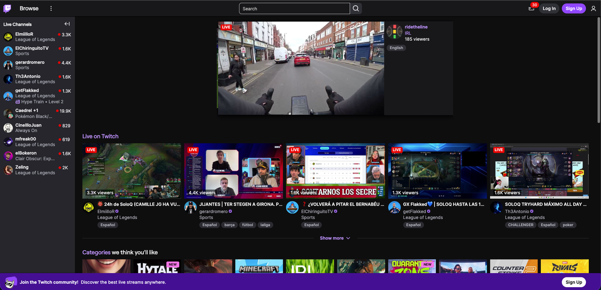
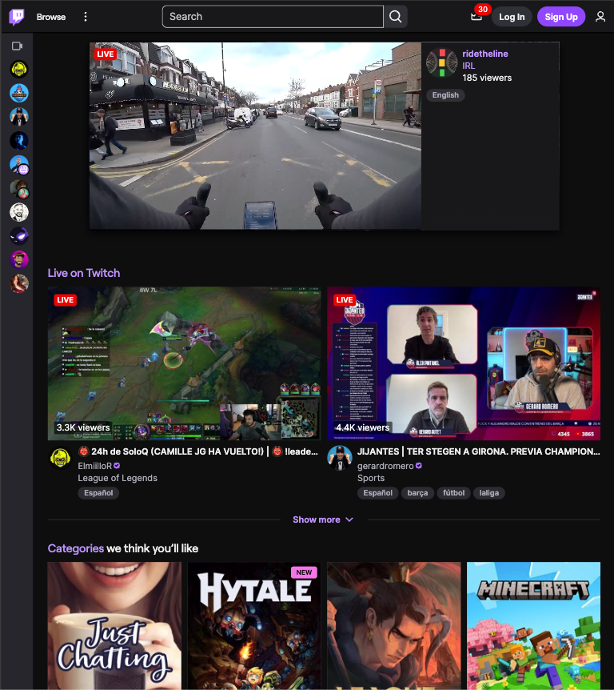
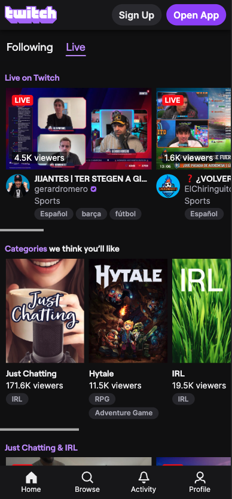
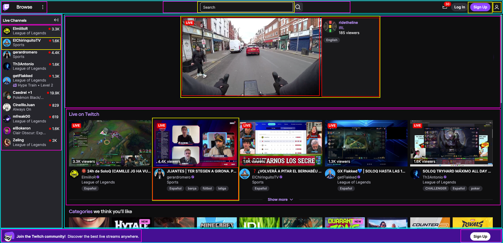

# Twitch clone with Tailwind CSS

<!-- hide -->

By [@marcogonzalo](https://github.com/marcogonzalo), [@ehiber](https://github.com/ehiber), and [other contributors](https://github.com/4GeeksAcademy/twitch-clone-tailwind/graphs/contributors) at [4Geeks Academy](https://4geeksacademy.com/)

[](https://4geeks.com)
[](https://x.com/4geeksacademy)

_Estas instrucciones tambien estan [disponibles en espanol](./README.es.md)_.

**Before you start**:

> We need you. These exercises are built and maintained collaboratively by people like you. If you find any typo or mistake, please contribute and/or report it.

<!-- endhide -->

---

## Your challenge

One of the most effective ways to learn how to build projects is to replicate real interfaces based on references that already exist on the Internet. In this challenge, you will build a replica of Twitch, the well-known streaming platform.

This project is a bit more sophisticated because you will work with **Tailwind CSS**, a styling library that helps you build interfaces quickly and consistently while keeping a clear visual structure.

The main focus is also something critical today: **responsive design**. People consume content from every kind of device, and mobile is often the primary one. Your replica must therefore adapt correctly to different screen sizes.

Below you will find the Twitch reference screenshots for desktop, tablet, and mobile layouts, plus an additional layered desktop view to help identify sections and visual components.

### Desktop


### Tablet


### Mobile


### Layered Desktop


---

## How to start the project

Open the starter repository using a provisioning tool such as [Codespaces](https://4geeks.com/lesson/what-is-github-codespaces) (recommended) or clone it locally:

```text
https://github.com/4GeeksAcademy/html-hello
```

Follow the steps in [how to start a coding project](https://4geeks.com/lesson/how-to-start-a-coding-project).

Important: create a new GitHub repository for your code, update the remote (`git remote set-url origin <your-new-url>`), and push your changes with `add`, `commit`, and `push`.

To incorporate Tailwind CSS into your project, add the official Tailwind CSS v4 CDN snippet inside your `<head>`:

```html
<head>
  <script src="https://cdn.jsdelivr.net/npm/@tailwindcss/browser@4"></script>
</head>
```

If you use AI to generate markup or classes, explicitly tell it to work with **Tailwind CSS v4** and verify that it is **not** using `cdn.tailwindcss.com` or Tailwind v3 snippets.

---

## What you need to do

The first thing you should do is identify visual elements or components in the interface. That will help you define a clearer strategy. For example:

- Does it have a navbar or header?
- Does it have a sidebar or lateral menu?
- How is the main content divided?
- Does it contain multiple sections?

We recommend starting with the mobile version because it has fewer elements and less space, but keep the elements from the larger layouts in mind because they must also have their own place later.

You should consider the `visibility` attribute to control elements that appear or disappear depending on the viewport.

You may only use:

- HTML
- Tailwind CSS

Tailwind must be integrated with the **Tailwind CSS v4 CDN** shown above.

You may not use:

- React
- Vue
- Angular
- Component-based JavaScript
- Any additional UI framework

Before accepting AI-generated code, confirm that the classes and setup are compatible with **Tailwind CSS v4**.

Additional activities:

- Add advanced visual effects and CSS animations

---

## What will be evaluated

- [ ] Correct layout composition with Tailwind
- [ ] Correct grouping of visual elements and components
- [ ] Proper presentation across mobile, tablet, and desktop screens
- [ ] Correct use of semantic HTML
- [ ] Consistent use of Tailwind CSS utilities

---

## How to submit this project

You must submit a repository that includes:

- The HTML document containing the full structure
- The CSS document with any additional styling and the media queries needed, if applicable
- A responsive replica based on the visual references included in this repository

---

This and many other projects are built by students as part of the [Coding Bootcamps](https://4geeksacademy.com/) at 4Geeks Academy. Learn more about the [courses](https://4geeksacademy.com/compare-programs) in [Full-Stack Software Developer](https://4geeksacademy.com/career-programs/full-stack-development), [Data Science & Machine Learning](https://4geeksacademy.com/en/career-programs/data-science-ml), [Cybersecurity](https://4geeksacademy.com/career-programs/cybersecurity), and [AI Engineering](https://4geeksacademy.com/career-programs/ai-engineering).
